# Jarkom-Modul-2-T7-2021      
### Laporan Resmi Pengerjaan Sesi Lab Jaringan Komputer     
        
#### Nama Anggota Kelompok :      
1. Naufal Aprilian (05311940000007)     
2. Bryan Yehuda Mannuel (05311940000021)      
3. Mulki Kusumah (05311940000043)     
      
## Pembukaan Soal         
Luffy adalah seorang yang akan jadi Raja Bajak Laut. Demi membuat Luffy menjadi Raja Bajak Laut, Nami ingin membuat sebuah peta, bantu Nami untuk membuat peta berikut:    
          

EniesLobby akan dijadikan sebagai DNS Master, Water7 akan dijadikan DNS Slave, dan Skypie akan digunakan sebagai Web Server. Terdapat 2 Client yaitu Loguetown, dan Alabasta. Semua node terhubung pada router Foosha, sehingga dapat mengakses internet      
         
## Jawaban Modul          
         
### Soal 1         
EniesLobby akan dijadikan sebagai DNS Master, Water7 akan dijadikan DNS Slave, dan Skypie akan digunakan sebagai Web Server. Terdapat 2 Client yaitu Loguetown, dan Alabasta. Semua node terhubung pada router Foosha, sehingga dapat mengakses internet       
    
### Jawaban Soal 1      
Kami membuat topologi terlebih dahulu sebagai berikut:       
           
Kemudian yang kami lakukan adalah melakukan konfigurasi pada setiap node yang ada:       
       
**Foosha sebagai Router**         
         
       
**Loguetown sebagai Client**  
```
apt-get update         
apt-get install dnsutils  
```
  

**Alabasta sebagai Client**  
  

**Enieslobby Sebagai DNS Master**  
```
apt-get update  
apt-get install bind9 -y  
```
  
  
**Water7 sebagai DNS Slave**  
```
apt-get update  
apt-get install bind9 -y       
echo "nameserver 192.168.122.1" > /etc/resolv.conf       
```        
           
            
**Skypie Sebagai Webserver**           
        
          
Kemudian setiap node diaktifkan dengan mengklik tombol start. Setelah itu, menjalankan command `iptables -t nat -A POSTROUTING -o eth0 -j MASQUERADE -s 10.45.0.0/16` pada router Foosha upaya dapat terkoneksi dengan internet.         

### SOAL 2   
Luffy ingin menghubungi Franky yang berada di EniesLobby dengan denden mushi. Kalian diminta Luffy untuk membuat website utama dengan mengakses `franky.yyy.com` dengan alias `www.franky.yyy.com` pada folder kaizoku  

### Jawaban Soal 2  
**Server EniesLobby**  
Melakukan konfigurasi terhadap file  `/etc/bind/named.conf.local` dengan menambahkan  
```
zone "franky.t07.com" {  
        type master;  
        file "/etc/bind/kaizoku/franky.t07.com";
};
```  
Membuat direktori baru yaitu `/etc/bind/kaizoku`  
Menambahkan konfigurasi pada `/etc/bind/kaizoku/franky.t07.com`  
```
$TTL    604800  
@       IN      SOA     franky.t07.com. root.franky.t07.com. (
                        2021100401      ; Serial
                        604800          ; Refresh
                        86400           ; Retry
                        2419200         ; Expire
                        604800 )        ; Negative Cache TTL
;
@               IN      NS      franky.t07.com.
@               IN      A       10.45.2.2 ; IP EniesLobby
www             IN      CNAME   franky.t07.com.

```
Melakukan restart service bind9 dengan `service bind9 restart`  

**Server Loguetown**  
```
apt-get update  
apt-get install dnsutils -y  
echo "nameserver 10.45.2.2" > /etc/resolv.conf  
```  

#### TESTING  
ping franky.t07.com

  

ping www.franky.t07.com
  

host -t CNAME www.franky.com

  

### SOAL 3  
Setelah itu buat subdomain `super.franky.yyy.com` dengan alias `www.super.franky.yyy.com` yang diatur DNS nya di EniesLobby dan mengarah ke Skypie(3).  
  
### Jawaban Soal 3  
**Server EniesLobby**  
Melakukan Edit pada file `/etc/bind/kaizoku/franky.t07.com` menjadi seperti berikut:  
```  
$TTL    604800  
@       IN      SOA     franky.t07.com. root.franky.t07.com. (  
                        2021100401      ; Serial
                        604800          ; Refresh
                        86400           ; Retry
                        2419200         ; Expire
                        604800 )        ; Negative Cache TTL
;
@               IN      NS      franky.t07.com.
@               IN      A       10.45.2.2 ; IP EniesLobby
www             IN      CNAME   franky.t07.com.
super           IN      A       10.45.2.4 ; IP skype
www.super       IN      CNAME   franky.t07.com.
```
Melakukan restart sevice bind9 dengan `service bind9 restart`  
  
#### TESTING  

ping super.franky.t07.com
  


ping www.super.franky.t07.com

  

host -t A super.franky.t07.com

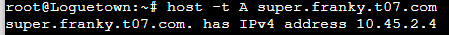

host -t CNAME www.super.franky.t07.com
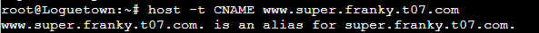

### SOAL 4   
Buat juga reverse domain untuk domain utama  
  
### Jawaban Soal 4  
**Server EsniesLobby**  
Edit file `/etc/bind/named.conf.local` menjadi sebagai berikut:  
```  
zone "franky.t07.com" {  
        type master;  
        file "/etc/bind/kaizoku/franky.t07.com";  
};

zone "2.45.10.in-addr.arpa" {
        type master;
        file "/etc/bind/kaizoku/2.45.10.in-addr.arpa";
};
```  
dan lakukan konfigurasi pada file `/etc/bind/kaizoku/2.45.10.in-addr.arpa` seperti berikut ini:  
```  
$TTL    604800  
@       IN      SOA     franky.t07.com. root.franky.t07.com. (
                        2021100401      ; Serial
                        604800          ; Refresh
                        86400         ; Retry
                        2419200         ; Expire
                        604800 )       ; Negative Cache TTL
;
2.45.10.in-addr.arpa.   IN      NS      franky.t07.com.
2                       IN      PTR     franky.t07.com.
```  
  
#### TESTING  
  
  
### SOAL 5  
Supaya tetap bisa menghubungi Franky jika server EniesLobby rusak, maka buat Water7 sebagai DNS Slave untuk domain utama  
  
### Jawaban Soal 5  
**Service Water7**  
lakukan konfigurasi pada file `/etc/bind/named.conf.local` sebagai berikut untuk melakukan konfigurasi DNS Slave yang mengarah ke water7:  
```  
zone "franky.t07.com" {  
        type master;
        notify yes;
        also-notify {10.45.2.3;};  //Masukan IP Water7 tanpa tanda petik
        allow-transfer {10.45.2.3;}; // Masukan IP Water7 tanpa tanda petik
        file "/etc/bind/kaizoku/franky.t07.com";
};
  
zone "2.45.10.in-addr.arpa" {
        type master;
        file "/etc/bind/kaizoku/2.45.10.in-addr.arpa";
};
```  
Melakukan restart sevice bind9 dengan `service bind9 restart`  
  
**Server Water7**  
Melakukan `apt-get update` dan menginstall bind9 dengan cara `apt-get install bind9 -y` dikarenakan water7 akan dijadikan DNS Slave.   
  
Lakukan konfigurasi pada file `/etc/bind/named.conf.local `  

```
zone "franky.t07.com" {
        type slave;
        masters { 10.45.2.2; }; // Masukan IP EniesLobby tanpa tanda petik
        file "/var/lib/bind/franky.t07.com";
};
```  
Melakukan restart sevice bind9 dengan `service bind9 restart`  

#### TESTING  
Melakukan stop service bind9 dengan cara berikut pada server EniesLobby

  

Melakukan ping dengan server Longuetown  
  

### SOAL 6  
Setelah itu terdapat subdomain `mecha.franky.yyy.com` dengan alias `www.mecha.franky.yyy.com` yang didelegasikan dari EniesLobby ke Water7 dengan IP menuju ke Skypie dalam folder sunnygo  
  
### Jawaban Soal 6  
**Server Enieslobby**  
Melakukan konfigurasi `/etc/bind/kaizoku/franky.t07.com`  
```
$TTL    604800
@       IN      SOA     franky.t07.com. root.franky.t07.com. (
                        2021100401      ; Serial
                        604800          ; Refresh
                        86400           ; Retry
                        2419200         ; Expire
                        604800 )        ; Negative Cache TTL
;
@               IN      NS      franky.t07.com.
@               IN      A       10.45.2.4 ; IP skypea
www             IN      CNAME   franky.t07.com.
super           IN      A       10.45.2.4 ; IP skypea
www.super       IN      CNAME   super.franky.t07.com.
ns1             IN      A       10.45.2.3; IP Water7
mecha           IN      NS      ns1
```  
Kemudian edit file `/etc/bind/named.conf.options` dan comment `dnssec-validation auto;` dan tambahkan baris berikut pada `/etc/bind/named.conf.options`  
```  
allow-query{any;};  
```  
Kemudian edit file `/etc/bind/named.conf.local` menjadi seperti  
```  
zone "franky.t07.com" {
        type master;
        //notify yes;
        //also-notify {10.45.2.3;};  Masukan IP Water7 tanpa tanda petik
        allow-transfer {10.45.2.3;}; // Masukan IP Water7 tanpa tanda petik
        file "/etc/bind/kaizoku/franky.t07.com";
};

zone "2.45.10.in-addr.arpa" {
        type master;
        file "/etc/bind/kaizoku/2.45.10.in-addr.arpa";
};
```
Melakukan restart sevice bind9 dengan `service bind9 restart`  
  
**Server Water7**  
Edit file `/etc/bind/named.conf.options` dan comment `dnssec-validation auto;` dan tambahkan baris berikut pada `/etc/bind/named.conf.options`
```  
allow-query{any;};  
```  
kemudian edit file `/etc/bind/named.conf.local` untuk delegasi `mecha.franky.t07.com`  
```  
zone "franky.t07.com" {
    type slave;
    masters { 10.45.2.2; }; // Masukan IP EniesLobby tanpa tanda petik
    file "/var/lib/bind/franky.t07.com";
};  
  
zone "mecha.franky.t07.com"{  
        type master;
        file "/etc/bind/sunnygo/mecha.franky.t07.com";
};  
```  
buat sebuah direktori `mkdir /etc/bind/sunnygo` dan Lakukan konfigurasi pada file `/etc/bind/sunnygo/mecha.franky.t07.com`
```  
$TTL    604800
@       IN      SOA     mecha.franky.t07.com. root.mecha.franky.t07.com. (
                        2021100401      ; Serial
                        604800         ; Refresh
                        86400         ; Retry
                        2419200         ; Expire
                        604800 )       ; Negative Cache TTL
;
@               IN      NS      mecha.franky.t07.com.
@               IN      A       10.45.2.4       ;ip skypie
www             IN      CNAME   mecha.franky.t07.com.
```  
Melakukan restart sevice bind9 dengan `service bind9 restart`
#### TESTING  
ping mecha.franky.t07.com
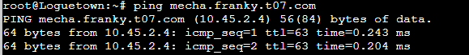
ping www.mecha.franky.t07.com
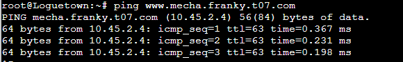
### SOAL 7  
Untuk memperlancar komunikasi Luffy dan rekannya, dibuatkan subdomain melalui Water7 dengan nama `general.mecha.franky.yyy.com` dengan alias `www.general.mecha.franky.yyy.com` yang mengarah ke Skypie  
  
### Jawaban Soal 7   
**Server Water7**  
konfigurasi file `/etc/bind/sunnygo/mecha.franky.t07.com` dengan  
```
$TTL    604800
@       IN      SOA     mecha.franky.t07.com. root.mecha.franky.t07.com. (
                        2021100401      ; Serial
                        604800         ; Refresh
                        86400         ; Retry
                        2419200         ; Expire
                        604800 )       ; Negative Cache TTL
;
@               IN      NS      mecha.franky.t07.com.
@               IN      A       10.45.2.4       ;ip skypie
www             IN      CNAME   mecha.franky.t07.com.
general         IN      A       10.45.2.4       ;IP skypie
www.general     IN      CNAME   mecha.franky.t07.com.
```
Melakukan restart sevice bind9 dengan `service bind9 restart`
  
#### TESTING  
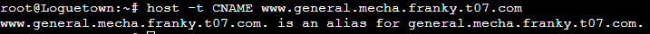
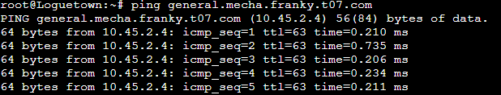
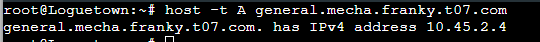
### SOAL 8
Setelah melakukan konfigurasi server, maka dilakukan konfigurasi Webserver. Pertama dengan webserver `www.franky.yyy.com.` Pertama, luffy membutuhkan webserver dengan DocumentRoot pada `/var/www/franky.yyy.com.`  
  
### Jawaban Soal 8     
**Client Loguetown**   
Melakukan `apt-get update` dan menginstall lynx dengan cara    
```
apt-get update
apt-get install lynx -y
```
  
**Server Skypie**      
Melakukan instalasi Apache, php, openssl untuk melakukan download ke website https dengan cara
```
apt-get install apache2 -y
service apache2 start
apt-get install php -y
apt-get install libapache2-mod-php7.0 -y
service apache2 
apt-get install ca-certificates openssl -y
```
konfigurasi file `/etc/apache2/sites-available/franky.t07.com.conf`. DcumentRoot diletakkan  di /var/www/franky.t07.com. Jangan lupa untuk menambah servername dan serveralias  
```
<VirtualHost *:80>

        ServerAdmin webmaster@localhost
        DocumentRoot /var/www/franky.t07.com
        ServerName franky.t07.com
        ServerAlias www.franky.t07.com

        ErrorLog \${APACHE_LOG_DIR}/error.log
        CustomLog \${APACHE_LOG_DIR}/access.log combined
</VirtualHost>
```
Lalu lakukan membaut sebuah direkroti root untuk server franky.t07.com dan melakukan copy file content
```
mkdir /var/www/franky.t07.com
cp -r /root/Praktikum-Modul-2-Jarkom/franky/. /var/www/franky.t07.com
service apache2 restart
```
  
#### TESTING  
lynx franky.t07.com

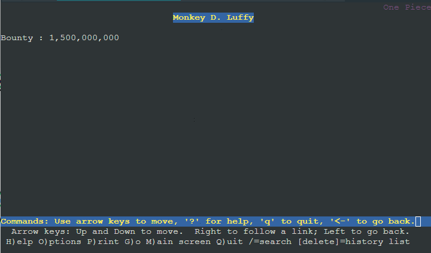

lynx www.franky.t07.com
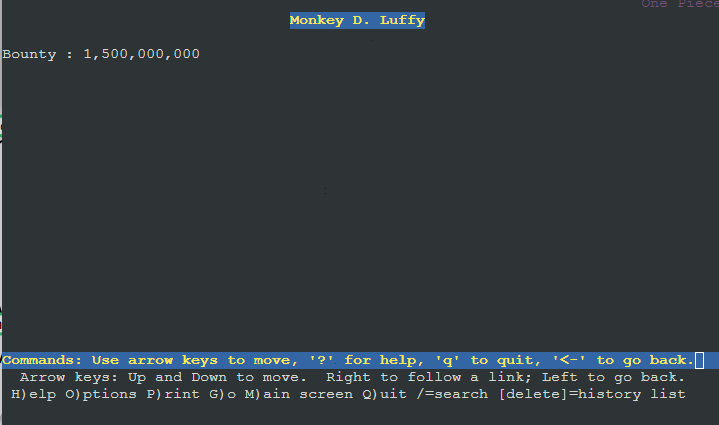
### SOAL 9
Setelah itu, Luffy juga membutuhkan agar url `www.franky.yyy.com/index.php/home` dapat menjadi menjadi `www.franky.yyy.com/home.`

### Jawaban Soal 9
**Server Skypie**     
konfigurasi file `/var/www/franky.t07.com/.htaccess` dengan    
```
a2enmod rewrite
service apache2 restart
echo "
RewriteEngine On
RewriteCond %{REQUEST_FILENAME} !-f
RewriteCond %{REQUEST_FILENAME} !-d
RewriteRule (.*) /index.php/\$1 [L]
```
Inti dari konfigurasi tersebut adalah kita melakukan cek apakah request tersebut adalah ke file atau bukan dan ke direktori atau bukan jika hal tersebut terpenuhi aka kita membuat rule untuk melakukan direct ke /index.php/home. $1 merupakan parameter yang diinputkan di url
konfigurasi file `/etc/apache2/sites-available/franky.t07.com.conf` dengan  
```
<VirtualHost *:80>
        ServerAdmin webmaster@localhost
        DocumentRoot /var/www/franky.t07.com
        ServerName franky.t07.com
        ServerAlias www.franky.t07.com

        ErrorLog \${APACHE_LOG_DIR}/error.log
        CustomLog \${APACHE_LOG_DIR}/access.log combined

        <Directory /var/www/franky.t07.com>
                Options +FollowSymLinks -Multiviews
                AllowOverride All
        </Directory>
</VirtualHost>
```
Melakukan restart service apache2 dengan `service apache2 restart`    

#### TESTING
lynx  www.franky.t07.com/home
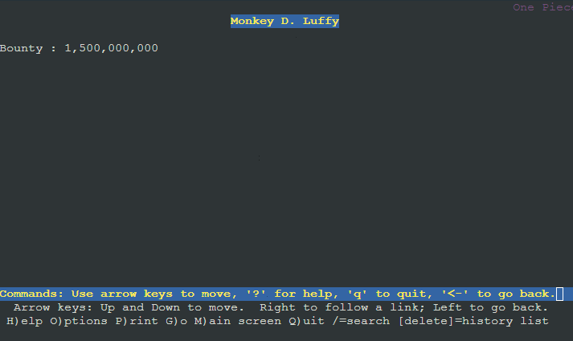
### SOAL 10
Setelah itu, pada subdomain `www.super.franky.yyy.com`, Luffy membutuhkan penyimpanan aset yang memiliki DocumentRoot pada `/var/www/super.franky.yyy.com`

### Jawaban Soal 10
**Server Skypie**    
konfigurasi file `/etc/apache2/sites-available/super.franky.t07.com.conf` dengan  
```
<VirtualHost *:80>

        ServerAdmin webmaster@localhost
        DocumentRoot /var/www/super.franky.t07.com
        ServerName super.franky.t07.com
        ServerAlias www.super.franky.t07.com

        ErrorLog \${APACHE_LOG_DIR}/error.log
        CustomLog \${APACHE_LOG_DIR}/access.log combined

        <Directory /var/www/franky.t07.com>
                Options +FollowSymLinks -Multiviews
                AllowOverride All
        </Directory>
</VirtualHost>
```
Lalu aktifkan virtualhost dengan a2ensite, membuat direktori untuk documentroot di /var/www/super.franky.t07.com dan jangan lupa untuk melakukan copy content ke documentroot dengan cara
```
a2ensite super.franky.t07.com
mkdir /var/www/super.franky.t07.com
cp -r /root/Praktikum-Modul-2-Jarkom/super.franky/. /var/www/super.franky.t07.com
service apache2 restart
```
konfigurasi file `/var/www/super.franky.t07.com/index.php` dengan `echo "<?php echo 'yes nomor 10' ?>"`    

#### TESTING
lynx  www.super.franky.t07.com .Untuk membuktikan kita membuat sebuah file index.php didalamnya
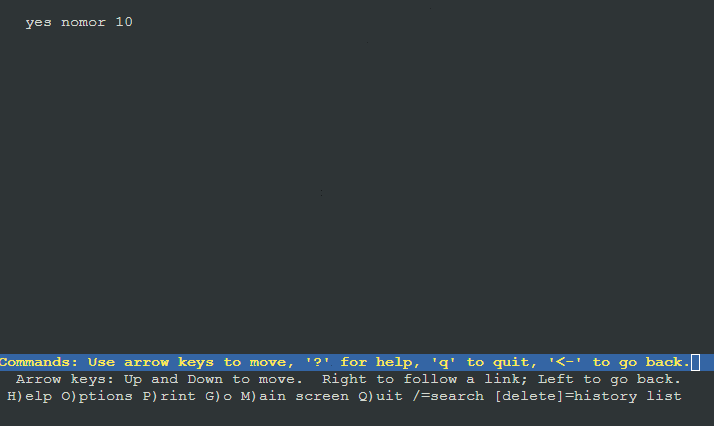
### SOAL 11
Akan tetapi, pada folder `/public`, Luffy ingin hanya dapat melakukan directory listing saja   

### Jawaban Soal 11
**Server Skypie**    
konfigurasi file `/etc/apache2/sites-available/super.franky.t07.com.conf` menamahkan Options +Indexes ke direktori yang ingin di directory list dengan  
```

<VirtualHost *:80>

        ServerAdmin webmaster@localhost
        DocumentRoot /var/www/super.franky.t07.com
        ServerName super.franky.t07.com
        ServerAlias www.super.franky.t07.com

        <Directory /var/www/super.franky.t07.com/public>
                Options +Indexes
        </Directory>

        ErrorLog \${APACHE_LOG_DIR}/error.log
        CustomLog \${APACHE_LOG_DIR}/access.log combined

        <Directory /var/www/franky.t07.com>
                Options +FollowSymLinks -Multiviews
                AllowOverride All
        </Directory>
</VirtualHost>

```     
Melakukan restart service apache2 dengan `service apache2 restart`    

#### TESTING
lynx  www.super.franky.t07.com/public
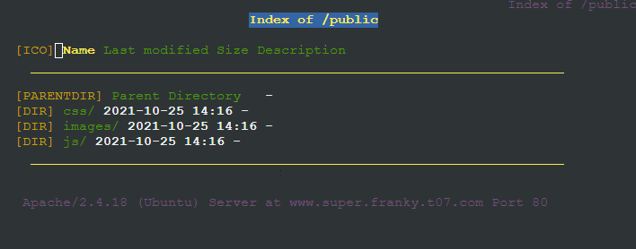
### SOAL 12
Tidak hanya itu, Luffy juga menyiapkan error file `404.html` pada folder `/error` untuk mengganti error kode pada apache 

### Jawaban Soal 12
**Server Skypie**    
konfigurasi file `/etc/apache2/sites-available/super.franky.t07.com.conf` menambahkan konfigurasi ErrorDocumentuntuk setiap error yang ada yang diarahkan ke file /error/404.html dengan  
```

<VirtualHost *:80>
        ServerAdmin webmaster@localhost
        DocumentRoot /var/www/super.franky.t07.com
        ServerName super.franky.t07.com
        ServerAlias www.super.franky.t07.com

        ErrorDocument 404 /error/404.html
        ErrorDocument 500 /error/404.html
        ErrorDocument 502 /error/404.html
        ErrorDocument 503 /error/404.html
        ErrorDocument 504 /error/404.html

        <Directory /var/www/super.franky.t07.com/public>
                Options +Indexes
        </Directory>

        ErrorLog \${APACHE_LOG_DIR}/error.log
        CustomLog \${APACHE_LOG_DIR}/access.log combined

        <Directory /var/www/franky.t07.com>
                Options +FollowSymLinks -Multiviews
                AllowOverride All
        </Directory>
</VirtualHost>

```     
Melakukan restart service apache2 dengan `service apache2 restart`   

#### TESTING
lynx  www.super.franky.t07.com/HAHAHA

### SOAL 13
Luffy juga meminta Nami untuk dibuatkan konfigurasi virtual host. Virtual host ini bertujuan untuk dapat mengakses file asset `www.super.franky.yyy.com/public/js` menjadi `www.super.franky.yyy.com/js`

### Jawaban Soal 13
**Server Skypie**    
konfigurasi file `/etc/apache2/sites-available/super.franky.t07.com.conf` menambahkan konfigurasi Alias dengan  
```
<VirtualHost *:80>

        ServerAdmin webmaster@localhost
        DocumentRoot /var/www/super.franky.t07.com
        ServerName super.franky.t07.com
        ServerAlias www.super.franky.t07.com

        ErrorDocument 404 /error/404.html
        ErrorDocument 500 /error/404.html
        ErrorDocument 502 /error/404.html
        ErrorDocument 503 /error/404.html
        ErrorDocument 504 /error/404.html

        <Directory /var/www/super.franky.t07.com/public>
                Options +Indexes
        </Directory>

        Alias \"/js\" \"/var/www/super.franky.t07.com/public/js\"


        ErrorLog \${APACHE_LOG_DIR}/error.log
        CustomLog \${APACHE_LOG_DIR}/access.log combined

        <Directory /var/www/franky.t07.com>
                Options +FollowSymLinks -Multiviews
                AllowOverride All
        </Directory>
</VirtualHost>
```     
Melakukan restart service apache2 dengan `service apache2 restart`   

#### TESTING    
lynx  www.super.franky.t07.com/js 

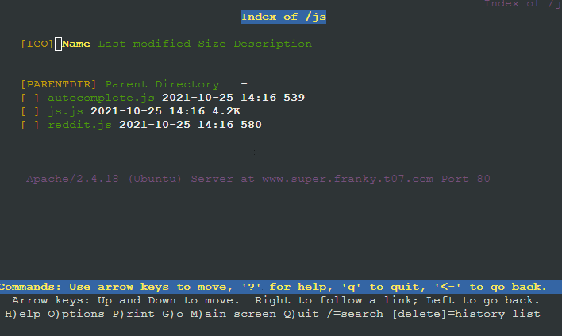
### SOAL 14
Dan Luffy meminta untuk web `www.general.mecha.franky.yyy.com` hanya bisa diakses dengan port 15000 dan port 15500

### Jawaban Soal 14
**Server Skypie**    
konfigurasi file `/etc/apache2/sites-available/general.mecha.franky.t07.com.conf` disini menambahkan CirtualHost baru yang berada pada port 15000 dan 15500 dengan  
```
<VirtualHost *:15000>

        ServerAdmin webmaster@localhost
        DocumentRoot /var/www/general.mecha.franky.t07.com
        ServerName general.mecha.franky.t07.com
        ServerAlias www.general.mecha.franky.t07.com


        ErrorLog \${APACHE_LOG_DIR}/error.log
        CustomLog \${APACHE_LOG_DIR}/access.log combined
</VirtualHost>
<VirtualHost *:15500>        
        ServerAdmin webmaster@localhost
        DocumentRoot /var/www/general.mecha.franky.t07.com
        ServerName general.mecha.franky.t07.com
        ServerAlias www.general.mecha.franky.t07.com
        

        ErrorLog \${APACHE_LOG_DIR}/error.log
        CustomLog \${APACHE_LOG_DIR}/access.log combined
</VirtualHost>
```     
Lalu lakukan
```
a2ensite general.mecha.franky.t07.com
service apache2 restart
mkdir /var/www/general.mecha.franky.t07.com
cp -r /root/Praktikum-Modul-2-Jarkom/general.mecha.franky/. /var/www/general.mecha.franky.t07.com/
```
konfigurasi file `/var/www/general.mecha.franky.t07.com/index.php` dengan     
```
<?php
    echo 'selamat 14';
?>
```
konfigurasi file `/etc/apache2/ports.conf` menambahkan Listen 15000 dan 15500 dengan     
```
# If you just change the port or add more ports here, you will likely also
# have to change the VirtualHost statement in
# /etc/apache2/sites-enabled/000-default.conf

Listen 80
Listen 15000
Listen 15500
<IfModule ssl_module>
        Listen 443
</IfModule>

<IfModule mod_gnutls.c>
        Listen 443
</IfModule>
```    
Melakukan restart service apache2 dengan `service apache2 restart`   

#### TESTING   
lynx  general.mecha.franky.t07.com:15000

lynx  general.mecha.franky.t07.com:15500
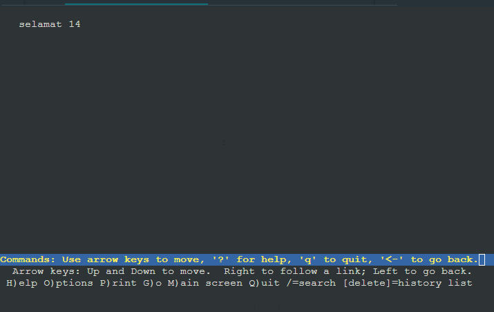
### SOAL 15
dengan authentikasi username luffy dan password onepiece dan file di `/var/www/general.mecha.franky.yyy`

### Jawaban Soal 15   
**Server Skypie**     
Jalankan Command `htpasswd -c -b /etc/apache2/.htpasswd luffy onepiece`    
konfigurasi file `/etc/apache2/sites-available/general.mecha.franky.t07.com.conf` dengan     
```
<VirtualHost *:15000>

        ServerAdmin webmaster@localhost
        DocumentRoot /var/www/general.mecha.franky.t07.com
        ServerName general.mecha.franky.t07.com
        ServerAlias www.general.mecha.franky.t07.com

        <Directory \"/var/www/general.mecha.franky.t07.com\">
                AuthType Basic
                AuthName \"Restricted Content\"
                AuthUserFile /etc/apache2/.htpasswd
                Require valid-user
        </Directory>

        ErrorLog \${APACHE_LOG_DIR}/error.log
        CustomLog \${APACHE_LOG_DIR}/access.log combined
</VirtualHost>
<VirtualHost *:15500>        
        ServerAdmin webmaster@localhost
        DocumentRoot /var/www/general.mecha.franky.t07.com
        ServerName general.mecha.franky.t07.com
        ServerAlias www.general.mecha.franky.t07.com
        
        <Directory \"/var/www/general.mecha.franky.t07.com\">
                AuthType Basic
                AuthName \"Restricted Content\"
                AuthUserFile /etc/apache2/.htpasswd
                Require valid-user
        </Directory>
        
        ErrorLog \${APACHE_LOG_DIR}/error.log
        CustomLog \${APACHE_LOG_DIR}/access.log combined
</VirtualHost>
```    
Melakukan restart service apache2 dengan `service apache2 restart`   

#### TESTING     

### SOAL 16
Dan setiap kali mengakses IP Skypie akan diahlikan secara otomatis ke `www.franky.yyy.com`

### Jawaban Soal 16  
**Server Skypie**   
konfigurasi file `/etc/apache2/sites-available/000-default.conf` dengan     
```
<VirtualHost *:80>

        ServerAdmin webmaster@localhost
        DocumentRoot /var/www/html

        RewriteEngine On
        RewriteCond %{HTTP_HOST} !^franky.t07.com$
        RewriteRule /.* http://franky.t07.com/ [R]

        ErrorLog \${APACHE_LOG_DIR}/error.log
        CustomLog \${APACHE_LOG_DIR}/access.log combined

</VirtualHost>
```    
Melakukan restart service apache2 dengan `service apache2 restart`  

#### TESTING     
lynx 10.45.2.4
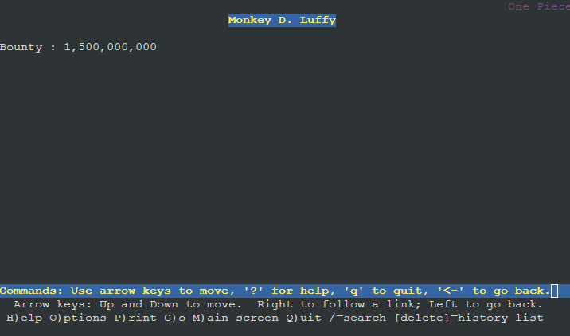
### SOAL 17
Dikarenakan Franky juga ingin mengajak temannya untuk dapat menghubunginya melalui website `www.super.franky.yyy.com`, dan dikarenakan pengunjung web server pasti akan bingung dengan randomnya images yang ada, maka Franky juga meminta untuk mengganti request gambar yang memiliki substring `“franky”` akan diarahkan menuju `franky.png`. Maka bantulah Luffy untuk membuat konfigurasi dns dan web server ini!


### Jawaban Soal 17     
**Server Skypie**   
konfigurasi file `/var/www/super.franky.t07.com/.htaccess` dengan     
```
echo "
RewriteEngine On
RewriteCond %{REQUEST_URI} ^/public/images/(.*)franky(.*)
RewriteCond %{REQUEST_URI} !/public/images/franky.png
RewriteRule /.* http://super.franky.t07.com/public/images/franky.png [L]
"
```    
konfigurasi file `/etc/apache2/sites-available/super.franky.t07.com.conf` dengan     
```
echo "
<VirtualHost *:80>

        ServerAdmin webmaster@localhost
        DocumentRoot /var/www/super.franky.t07.com
        ServerName super.franky.t07.com
        ServerAlias www.super.franky.t07.com

        ErrorDocument 404 /error/404.html
        ErrorDocument 500 /error/404.html
        ErrorDocument 502 /error/404.html
        ErrorDocument 503 /error/404.html
        ErrorDocument 504 /error/404.html

        <Directory /var/www/super.franky.t07.com/public>
                Options +Indexes
        </Directory>

        Alias \"/js\" \"/var/www/super.franky.t07.com/public/js\"

        <Directory /var/www/super.franky.t07.com>
                Options +FollowSymLinks -Multiviews
                AllowOverride All
        </Directory>
        ErrorLog \${APACHE_LOG_DIR}/error.log
        CustomLog \${APACHE_LOG_DIR}/access.log combined

        <Directory /var/www/franky.t07.com>
                Options +FollowSymLinks -Multiviews
                AllowOverride All
        </Directory>
</VirtualHost>
"
```    
Melakukan restart service apache2 dengan `service apache2 restart`  

#### TESTING     
lynx super.franky.t07.com/public/images/HAHAfrankyYUHU
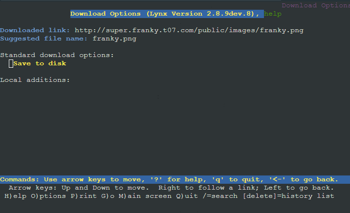
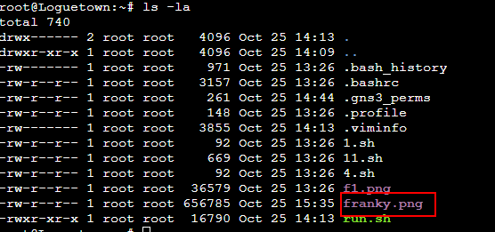
## Kendala
