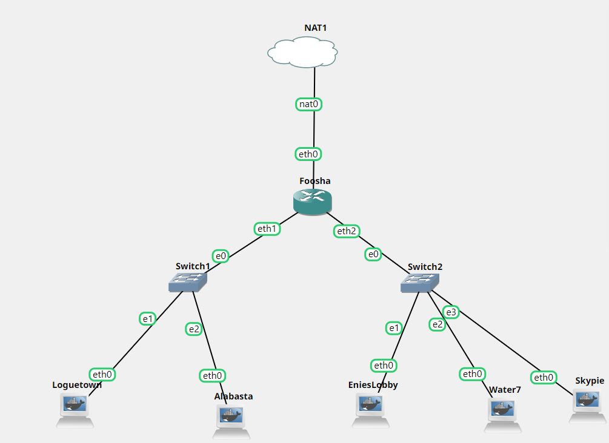

# Jarkom-Modul-2-T7-2021
### SOAL 1
Luffy adalah seorang yang akan jadi Raja Bajak Laut. Demi membuat Luffy menjadi Raja Bajak Laut, Nami ingin membuat sebuah peta, bantu Nami untuk membuat peta berikut:

EniesLobby akan dijadikan sebagai DNS Master, Water7 akan dijadikan DNS Slave, dan Skypie akan digunakan sebagai Web Server. Terdapat 2 Client yaitu Loguetown, dan Alabasta. Semua node terhubung pada router Foosha, sehingga dapat mengakses internet 

#### JAWABAN

Kami membuat topologi terlebih dahulu sebagai berikut:

Kemudian yang kami lakukan adalah melakukan konfigurasi pada setiap node yang ada:

[Foosha sebagai Router]

[Longuetown sebagai Client]

[Alabasta sebagai Client]

[Enieslobby Sebagai DNS Master]

[Water7 sebagai DNS Slave]

[Skypie Sebagai Webserver]


Kemudian setiap node diaktifkan dengan mengklik tombol start. Setelah itu, menjalankan command iptables -t nat -A POSTROUTING -o eth0 -j MASQUERADE -s 10.45.0.0/16 pada router Foosha upaya dapat terkoneksi dengan internet.

### SOAL 2
Luffy ingin menghubungi Franky yang berada di EniesLobby dengan denden mushi. Kalian diminta Luffy untuk membuat website utama dengan mengakses franky.yyy.com dengan alias www.franky.yyy.com pada folder kaizoku

#### JAWABAN

[server EniesLobby]
Melakukan konfigurasi terhadap file  /etc/bind/named.conf.local dengan menambahkan
```
zone "franky.t07.com" {
        type master;
        file "/etc/bind/kaizoku/franky.t07.com";
};
```
membuat direktori baru yaitu ```/etc/bind/kaizoku```
Menambahkan konfigurasi pada /etc/bind/kaizoku/franky.t07.com
```
$TTL    604800
@       IN      SOA     franky.t07.com. root.franky.t07.com. (
                        2021100401      ; Serial
                        604800          ; Refresh
                        86400           ; Retry
                        2419200         ; Expire
                        604800 )        ; Negative Cache TTL
;
@               IN      NS      franky.t07.com.
@               IN      A       10.45.2.2 ; IP EniesLobby
www             IN      CNAME   franky.t07.com.

```
Melakukan restart sevice bind9 dengan ```service bind9 restart```

#### TESTING


### SOAL 3
Setelah itu buat subdomain super.franky.yyy.com dengan alias www.super.franky.yyy.com yang diatur DNS nya di EniesLobby dan mengarah ke Skypie(3).

#### JAWABAN
[Server EniesLobby]
Melakukan Edit pada file /etc/bind/kaizoku/franky.t07.com dengan menjadi seperti berikut:
```
$TTL    604800
@       IN      SOA     franky.t07.com. root.franky.t07.com. (
                        2021100401      ; Serial
                        604800          ; Refresh
                        86400           ; Retry
                        2419200         ; Expire
                        604800 )        ; Negative Cache TTL
;
@               IN      NS      franky.t07.com.
@               IN      A       10.45.2.2 ; IP EniesLobby
www             IN      CNAME   franky.t07.com.
super           IN      A       10.45.2.4 ; IP skype
www.super       IN      CNAME   franky.t07.com.
```
Melakukan restart sevice bind9 dengan ```service bind9 restart```

#### TESTING


### SOAL 4
Buat juga reverse domain untuk domain utama
#### JAWABAN
[Server EsniesLobby]
Edit file /etc/bind/named.conf.local menjadi sebagai berikut:
```
zone "franky.t07.com" {
        type master;
        file "/etc/bind/kaizoku/franky.t07.com";
};

zone "2.45.10.in-addr.arpa" {
        type master;
        file "/etc/bind/kaizoku/2.45.10.in-addr.arpa";
};
```

dan lakukan konfigurasi pada file /etc/bind/kaizoku/2.45.10.in-addr.arpa seperti berikut ini:
```
$TTL    604800
@       IN      SOA     franky.t07.com. root.franky.t07.com. (
                        2021100401      ; Serial
                        604800          ; Refresh
                        86400         ; Retry
                        2419200         ; Expire
                        604800 )       ; Negative Cache TTL
;
2.45.10.in-addr.arpa.   IN      NS      franky.t07.com.
2                       IN      PTR     franky.t07.com.
```
#### TESTING

### SOAL 5
Supaya tetap bisa menghubungi Franky jika server EniesLobby rusak, maka buat Water7 sebagai DNS Slave untuk domain utama
#### JAWABAN
[Service Water7]
lakukan konfigurasi pada file /etc/bind/named.conf.local sebagai berikut:
```
zone "franky.t07.com" {
        type master;
        notify yes;
        also-notify {10.45.2.3;};  //Masukan IP Water7 tanpa tanda petik
        allow-transfer {10.45.2.3;}; // Masukan IP Water7 tanpa tanda petik
        file "/etc/bind/kaizoku/franky.t07.com";
};

zone "2.45.10.in-addr.arpa" {
        type master;
        file "/etc/bind/kaizoku/2.45.10.in-addr.arpa";
};
```
Melakukan restart sevice bind9 dengan ```service bind9 restart```

[Server Water7]
Melakukan ```apt-get update``` dan menginstall bind9 dengan cara ```apt-get install bind9 -y``` dikarenakan water7 akan dijadikan DNS Slave. 

Lakukan konfigurasi pada file /etc/bind/named.conf.local 

```
zone "franky.t07.com" {
        type slave;
        masters { 10.45.2.2; }; // Masukan IP EniesLobby tanpa tanda petik
        file "/var/lib/bind/franky.t07.com";
};
```
Melakukan restart sevice bind9 dengan ```service bind9 restart```
#### TESTING
Melakukan stop service bind9 dengan cara berikut pada server EniesLobby

Melakukan ping dengan server Longuetown

### SOAL 6
Setelah itu terdapat subdomain mecha.franky.yyy.com dengan alias www.mecha.franky.yyy.com yang didelegasikan dari EniesLobby ke Water7 dengan IP menuju ke Skypie dalam folder sunnygo
#### JAWABAN
[Server Enieslobby]
Melakukan konfigurasi /etc/bind/kaizoku/franky.t07.com
```
$TTL    604800
@       IN      SOA     franky.t07.com. root.franky.t07.com. (
                        2021100401      ; Serial
                        604800          ; Refresh
                        86400           ; Retry
                        2419200         ; Expire
                        604800 )        ; Negative Cache TTL
;
@               IN      NS      franky.t07.com.
@               IN      A       10.45.2.2 ; IP EniesLobby
www             IN      CNAME   franky.t07.com.
super           IN      A       10.45.2.3 ; IP Water7
www.super       IN      CNAME   franky.t07.com.
ns1             IN      NS      10.45.2.3; IP Water7
mecha           IN      NS      ns
www.mecha   	IN  	CNAME   franky.t07.com.
```
Kemudian edit file /etc/bind/named.conf.options .Kemudian comment dnssec-validation auto; dan tambahkan baris berikut pada /etc/bind/named.conf.options
```
allow-query{any;};
```

Kemudian edit file /etc/bind/named.conf.local menjadi seperti
```
zone "franky.t07.com" {
        type master;
        //notify yes;
        //also-notify {10.45.2.3;};  Masukan IP Water7 tanpa tanda petik
        allow-transfer {10.45.2.3;}; // Masukan IP Water7 tanpa tanda petik
        file "/etc/bind/kaizoku/franky.t07.com";
};

zone "2.45.10.in-addr.arpa" {
        type master;
        file "/etc/bind/kaizoku/2.45.10.in-addr.arpa";
};
```
Melakukan restart sevice bind9 dengan ```service bind9 restart```

[Server Water7]
Edit file /etc/bind/named.conf.options .Kemudian comment dnssec-validation auto; dan tambahkan baris berikut pada /etc/bind/named.conf.options
```
allow-query{any;};
```
kemudian edit file /etc/bind/named.conf.local untuk delegasi mecha.franky.t07.com
```
zone "franky.t07.com" {
    type slave;
    masters { 10.45.2.2; }; // Masukan IP EniesLobby tanpa tanda petik
    file "/var/lib/bind/franky.t07.com";
};

zone "mecha.franky.t07.com"{
        type master;
        file "/etc/bind/sunnygo/mecha.franky.t07.com";
};
```
buat sebuah direktori ```mkdir /etc/bind/sunnygo```. Lakukan konfigurasi pada file /etc/bind/sunnygo/mecha.franky.t07.com
```
$TTL    604800
@       IN      SOA     mecha.franky.t07.com. root.mecha.franky.t07.com. (
                        2021100401      ; Serial
                        604800         ; Refresh
                        86400         ; Retry
                        2419200         ; Expire
                        604800 )       ; Negative Cache TTL
;
@               IN      NS      mecha.franky.t07.com.
@               IN      A       10.45.2.4       ;ip skypie
www             IN      CNAME   mecha.franky.t07.com.

```
Melakukan restart sevice bind9 dengan ```service bind9 restart```
#### TESTING

### SOAL 7
Untuk memperlancar komunikasi Luffy dan rekannya, dibuatkan subdomain melalui Water7 dengan nama general.mecha.franky.yyy.com dengan alias www.general.mecha.franky.yyy.com yang mengarah ke Skypie
#### JAWABAN
[Server Water7]
konfigurasi file dengan
```
\$TTL    604800
@       IN      SOA     mecha.franky.t07.com. root.mecha.franky.t07.com. (
                        2021100401      ; Serial
                        604800         ; Refresh
                        86400         ; Retry
                        2419200         ; Expire
                        604800 )       ; Negative Cache TTL
;
@               IN      NS      mecha.franky.t07.com.
@               IN      A       10.45.2.4       ;ip skypie
www             IN      CNAME   mecha.franky.t07.com.
general         IN      A       10.45.2.4       ;IP skypie
www.general     IN      CNAME   mecha.franky.t07.com.
```
#### TESTING

### SOAL 8

#### JAWABAN

#### TESTING


